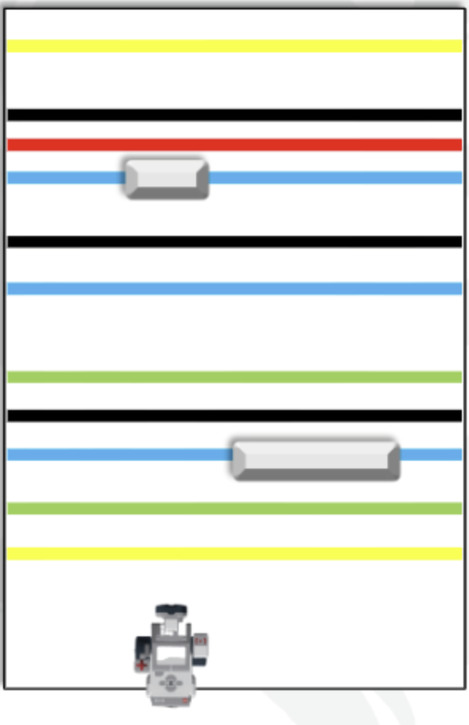

# EV3 Autonomous Car Control System

## 프로젝트 개요
LEGO Mindstorms EV3를 활용한 자율주행 로봇 제어 시스템입니다. 다양한 센서를 통합하여 색상 인식 기반 경로 추적, 장애물 회피, 그리고 복잡한 주행 패턴을 구현합니다.

## 프로젝트 이미지

## 주요 기능

### 센서 통합 제어
- **터치 센서**: 시작 트리거
- **컬러 센서**: 경로 색상 인식 및 위치 판단
- **자이로 센서**: 정밀한 회전 각도 제어
- **초음파 센서**: 장애물 거리 측정 및 회피

### 자율주행 기능
- **시작/종료 지점 인식**: 특정 색상(검정/초록/노랑/갈색) 감지 시 LED 제어 및 주행 시작/종료
- **검정색 구간 카운팅**: 경로 상의 검정색 구간 통과 횟수를 실시간으로 추적
- **경과 시간 측정**: 시작 지점부터 종료 지점까지의 주행 시간을 초 단위로 기록 및 디스플레이 출력

### 지시색 기반 동작
#### 파랑색 감지
- 통과한 검정색 구간 개수만큼 경고음(beep) 반복 출력
- 시각/청각 피드백 제공
  
#### 빨강색 감지
- 속도를 정상의 1/2로 감속
- 반시계방향 90도 포인트 턴 수행
- (검정색 구간 개수 × 10cm) 거리만큼 전진
- 반시계방향 90도 포인트 턴으로 복귀
- 정상 속도로 재가속

### 장애물 회피 시스템
#### 50cm 미만 감지
- 경고음 출력
- 속도를 정상의 1/2로 감속하여 접근

#### 10cm 미만 감지
- 즉시 20cm 후진
- 시계방향 90도 포인트 턴
- (검정색 구간 개수 × 10cm) 거리만큼 우회
- 시계방향 90도 포인트 턴으로 원래 방향 복귀
- 정상 속도로 재가속

### 안전 종료 조건
- 종료 지점(시작 지점과 동일한 색상) 감지
- 검정색 구간 10회 진입 시 자동 정지
- 총 주행 시간 디스플레이 출력